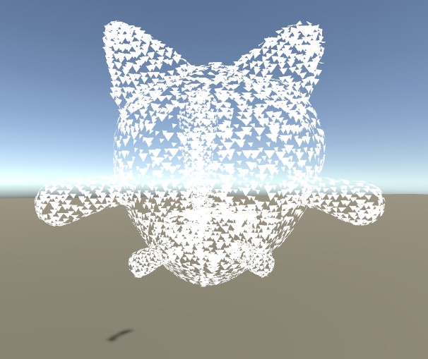
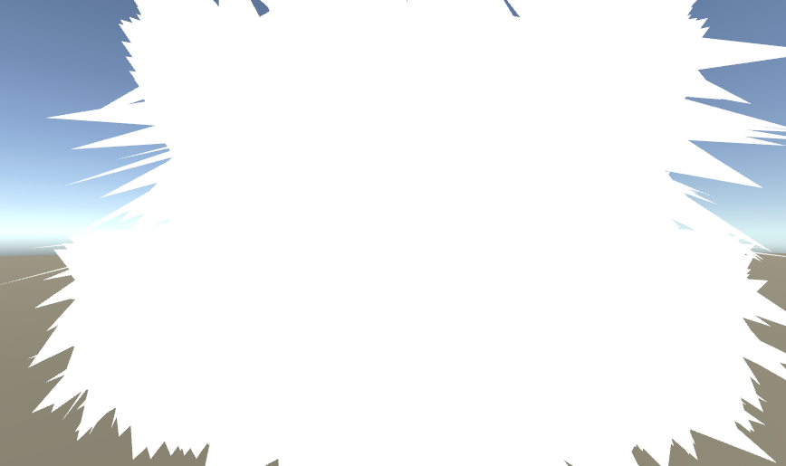

# Shaders Study
<h3>Kyle Neubarth</h3>
A short exploration of shaders in Unity3D through CU Boulder's Independent Study program.

The Unity project itself is a small VR space where the user can teleport around and view the various shaders discussed below. The contents of this page will consist of a brief demonstration and explanation of each of the shader I have made during this study.
This page will consist of a light tutorial involving Unity shader mechanics as I move through each of the shader programs I have studied, hopefully giving an idea of my though process throughout the study. Most of the code below will have a brief description of the concepts involved in the shader, and then heavily annotated code to show how these concepts are applied.

Some of the later shaders are derivative of existing projects, which will be cited below.

# Contents

- [Basic Shader]
- [Display Normals]
- [Display UVs]
- [PCX Point Cloud]
- [Leon Point Could]

## Basic Shader

This is the skeleton of a basic unity shader. By itself, this shader is rather pointless as it just uses the included "diffuse" shader with an input color. 

```c#
//This decleares a shader with said title. 
//The title doesn't need to match the name of the script, and can by found in the unity shaders hirearchy under the path used
Shader "Tutorial/Basic" {
	//The properties block contains all variables that can be changed in the editor
	//They must have a name (_Color), an editor display name ("Main Color"), a type (Color) and an initial value
	Properties{
		_Color("Main Color", Color) = (1,0.5,0.5,1)
	}
	//a shader can contain multiple subshaders, which are primarily meant for different GPU types, but we won't woory about this here
	SubShader{
		//a pass is a single exectuion of code on the object, multiple passes can be used for different effects
		Pass {
			//This section isn't important for us now, it just sets the premade material with the premade shader
			Material {
				//This references our variable, color! note how variables always have an underscore before them
				Diffuse[_Color]
			}
			Lighting On
		}
	}
}
```

## Display Normals Shader


Building off of our template, this shader uses vertex and frgment shader in order to display the normals of the object as colors. 

There are multiple stages in a shader's "pipeline". The vertex shader takes in ecah vertex of an object to perform operations on it. Usually for our purposes this means transforming the vertex coordinates into unity world space, and then saving important information about the vertex into a structure that will be passed to the fragment shader. Then the fragment shader runs on every pixel of the object, which in this case means displaying a color corresponding to the normals we found in the vertex shader.

You will also see capitalized words to the right of some varibles. These are call Semantics and are used to tell the compiler what the variable will be used for. This is necessary in shaders, and a list of semantics can be found [here](https://docs.microsoft.com/en-us/windows/win32/direct3dhlsl/dx-graphics-hlsl-semantics?redirectedfrom=MSDN).

```c#
  
Shader "Tutorial/DisplayNormals"
{
	SubShader{

		Pass {
			//We are starting a CG script
			CGPROGRAM
			//has a vertex function named vert
			#pragma vertex vert
			//has a fragment function named frag
			#pragma fragment frag
			//include for useful functions, appbase is a structure used here used here
			#include "UnityCG.cginc"

			//this struct will relay data from the vert shader to the frag shader.
			//here we relay the position of the vertex (common) and a color based on the normal of that vertex
			struct v2f {

				float4 pos : SV_POSITION;
				fixed3 color : COLOR0;

			};
			///appdata is a helpful struct included from UnityCG.cginc which contains all the vertex data we need
			v2f vert(appdata_base v) {
				v2f o;
				//this magical function transforms the vertex data from v into worldspace
				o.pos = UnityObjectToClipPos(v.vertex);
				//transform the normal into a color!
				o.color = v.normal * 0.5 + 0.5;
				return o;
			}
			//not much to do here, just return the color that was relayed
			fixed4 frag(v2f i) : SV_Target{
				return fixed4(i.color,1);
			}

			ENDCG

		}

	}
	//did the subshader fail because my computer is a potato? Then just use this built in shader instead
	Fallback "TexturedColored"
}
```

## Display UVs Shader


This shader runs on a very similar principle to the previous one, expect it renders the texture coordinates (UVs) instead of the normals.

```c#
Shader "Tutorial/DisplayUV"
{
	SubShader
	{
		Pass
		{
			CGPROGRAM
			#pragma vertex vert
			#pragma fragment frag

			struct v2f {
				float2 uv : TEXCOORD0;
				float4 pos : SV_POSITION;
			};
			//Here we won't use the appdata struct because we need the UV coordinates
			//v represents the position of the vertex, and uv the UV of the vertex
			//both use the required semantics!
			v2f vert( float4 v : POSITION, uv : TEXCOORD0)
			{
				v2f o;
				//this magical function transforms the vertex data from v into worldspace
				o.pos = UnityObjectToClipPos(v);
				//no math here, the uv can be directly read as a color!
				o.uv = uv;
				return o;
			}

			fixed4 frag(v2f i) : SV_Target
			{
				return fixed4(i.uv, 0, 0);
			}
			ENDCG
		}
	}
	//did the subshader fail because my computer is a potato? Then just use this built in shader instead
	Fallback "TexturedColored"
}
```

## Texture + Color Shader


This shader is a more typical shader. It takes a texture, applies it to an object, and then applies a color. This was more of a practice in applying user input and correctly applying it to the shaders. 

```c#
Shader "Tutorial/Textured Colored" {
	Properties{
		//two user inputs, defined and initialized
		_Color("Main Color", Color) = (1,1,1,0.5)
		_MainTex("Texture", 2D) = "white" { }
	}
		SubShader{
			Pass {

			CGPROGRAM
			//define shader functions
			#pragma vertex vert
			#pragma fragment frag

			#include "UnityCG.cginc"
			
			//instantiate user inputs in the shader code
			fixed4 _Color;
			sampler2D _MainTex;

			struct v2f {
				float4 pos : SV_POSITION;
				float2 uv : TEXCOORD0;
			};
			//appdata base is a struct included in UnityCG, used as input for vertex shader
			v2f vert(appdata_base v)
			{
				v2f o;
				//translates position into world space
				o.pos = UnityObjectToClipPos(v.vertex);
				//transforms texture coords into coords on the object itself
				o.uv = TRANSFORM_TEX(v.texcoord, _MainTex);
				return o;
			}

			fixed4 frag(v2f i) : SV_Target
			{
				//get the color from the texture, then multiply it by our input color
				fixed4 texcol = tex2D(_MainTex, i.uv);
				return texcol * _Color;
			}
			ENDCG

		}
	}
}
```
## Leon's Point Cloud Shader


This code is provided by Leon196
<a href = "https://github.com/leon196/PointCloudExporter">Link to Leon's repo</a>

This point cloud shader uses the geomtry shader section to counstruct triangles at each vertice. The geometry shader is an optional pipeline step inbetween the vertex and fragment steps, where we can use vertex data to create primitives. Geometry shaders are a little more complex than the other two we have covered. They take in arrays of vertices from the vertex shader, create geometry given that vertex data, and then push those triangles to a triangle stream which is fed into the fragment shader.

An interesting thing to note is that these triangles have a size parameter and face in the direction of the vertex normals. When the size of these triangles is large enough you get something like this:



```c#
Shader "Unlit/LeonPointCloud"
{
	Properties
	{
		_MainTex ("Texture (RGB)", 2D) = "white" {}
		_Size ("Size", Float) = 0.1
	}
	SubShader
	{
		Tags { "Queue"="AlphaTest" "RenderType"="Transparent" "IgnoreProjector"="True" }
		Blend One OneMinusSrcAlpha
		AlphaToMask On
		Cull Off

		Pass
		{
			CGPROGRAM
			//Define the functions for each shader
			#pragma vertex vert
			#pragma geometry geom
			#pragma fragment frag
			
			#include "UnityCG.cginc"
			
			//input variables
			sampler2D _MainTex;
			float _Size;
			
			//each of these structs define the inputs for each shader step
			
			struct GS_INPUT
			{
				float4 vertex : POSITION;
				float3 normal	: NORMAL;
				float4 color	: COLOR;
				float2 texcoord : TEXCOORD0;
				float2 texcoord1 : TEXCOORD1;
			};

			struct FS_INPUT {
				float4 vertex : SV_POSITION;
				float3 normal : NORMAL;
				float4 color : COLOR;
				float2 texcoord : TEXCOORD0;
			};
			
			//appdata_full is defined in UnityCG, and holds everything you would need in a vertex shader
			GS_INPUT vert (appdata_full v)
			{
				GS_INPUT o = (GS_INPUT)0;
				o.vertex = v.vertex;
				o.normal = v.normal;
				o.color = v.color;
				return o;
			}

			//the geometry shader should at most output 3 vertices! (because triangles)
			[maxvertexcount(3)]
			//this part is a little tricky
			//inputs are in arrays of 1 because it only does one point at a time, one vertex
			//the inout keyword is needed for the output of the geometry shader
			void geom (point GS_INPUT tri[1], inout TriangleStream<FS_INPUT> triStream)
			{
				//initialize to zero, think this is redundant but might avoid errors
				FS_INPUT pIn = (FS_INPUT)0;
				pIn.normal = mul(unity_ObjectToWorld, tri[0].normal);
				pIn.color = tri[0].color;
			
				//the rest of this code calculates the three edges of the triangle and appends them to the output stream
			
				float4 vertex = mul(unity_ObjectToWorld, tri[0].vertex);
				float3 tangent = normalize(cross(float3(0,1,0), pIn.normal));
				float3 up = normalize(cross(tangent, pIn.normal));

				pIn.vertex = mul(UNITY_MATRIX_VP, vertex + float4(tangent * -_Size / 1.5, 0));
				pIn.texcoord = float2(-0.5,0);
				triStream.Append(pIn);

				pIn.vertex = mul(UNITY_MATRIX_VP, vertex + float4(up * _Size, 0));
				pIn.texcoord = float2(0.5,1.5);
				triStream.Append(pIn);

				pIn.vertex = mul(UNITY_MATRIX_VP, vertex + float4(tangent * _Size / 1.5, 0));
				pIn.texcoord = float2(1.5,0);
				triStream.Append(pIn);
			}

			float4 frag (FS_INPUT i) : COLOR
			{
				float4 color = i.color;
				//apply colors to the mesh based on the texture provided!
				color.a = step(0.5, tex2D(_MainTex, i.texcoord).a);
				return color;
			}
			ENDCG
		}
	}
}
```

## PCX's Point Cloud Shader


Modified code based off of code by Keijiro Takahashi
<a href="https://github.com/keijiro/Pcx">Link to PCX Github Page</a>

This point cloud takes a different approach to the same problem, but uses disks instead of primitive triangles to display points. The way it functions is practically identical, but the geometry shader puts together an entire disk based on the point size. This means that higher point sizes will have many more verices, and can slow down the editor if each vertex of the point cloud has a disk containing the maximum 32 vertices. Another notable difference is that the actual shader functions are put in an include(Disk.cginc) file rather than in the main file. This works because #include in Unity shader language inserts the contents of the file where it is to be included. 

```c#
Shader "Point Cloud/Disk"
{
    Properties
    {
    	//tint controls the color of the cloud	
	//point size controls the size of the disks
        _Tint("Tint", Color) = (0.5, 0.5, 0.5, 1)
        _PointSize("Point Size", Float) = 0.05
    }
    SubShader
    {
        Tags { "RenderType"="Opaque" }
        Cull Off
        Pass
        {
            Tags { "LightMode"="ForwardBase" }
            CGPROGRAM
	    
	    //declare shader functions
            #pragma vertex Vertex
            #pragma geometry Geometry
            #pragma fragment Fragment
	    
            #pragma multi_compile_fog
            #pragma multi_compile _ UNITY_COLORSPACE_GAMMA
            #pragma multi_compile _ _COMPUTE_BUFFER
	    
	    //Vertex, Geometry, and Fragment shaders are included here, check below
            #include "Disk.cginc"
            ENDCG
        }
        Pass
        {
            Tags { "LightMode"="ShadowCaster" }
            CGPROGRAM
	    //declare shader functions
            #pragma vertex Vertex
            #pragma geometry Geometry
            #pragma fragment Fragment
            #pragma multi_compile _ _COMPUTE_BUFFER
            #define PCX_SHADOW_CASTER 1
	    
	    //Vertex, Geometry, and Fragment shaders are included here, check below
            #include "Disk.cginc"
            ENDCG
        }
    }
    CustomEditor "Pcx.DiskMaterialInspector"
}
```
This is Disk.cginc, the actual file included
```c#

// Pcx - Point cloud importer & renderer for Unity
// https://github.com/keijiro/Pcx

#include "UnityCG.cginc"
//for encoding/decoding colors
#include "Common.cginc"

// Uniforms
half4 _Tint;
half _PointSize;
float4x4 _Transform;

#if _COMPUTE_BUFFER
StructuredBuffer<float4> _PointBuffer;
#endif

// Vertex input attributes
struct Attributes
{
#if _COMPUTE_BUFFER
    uint vertexID : SV_VertexID;
#else
    float4 position : POSITION;
    half3 color : COLOR;
#endif
};

// Fragment varyings
//This is the input for the geometry shader, and the output of the vertex shader
struct Varyings
{
	float2 uv : TEXCOORD0;
    float4 position : SV_POSITION;
#if !PCX_SHADOW_CASTER
    half3 color : COLOR;
    UNITY_FOG_COORDS(0)
#endif
};

// Vertex phase
Varyings Vertex(Attributes input)
{
    // Retrieve vertex attributes.
#if _COMPUTE_BUFFER
    float4 pt = _PointBuffer[input.vertexID];
    float4 pos = mul(_Transform, float4(pt.xyz, 1));
    half3 col = PcxDecodeColor(asuint(pt.w));
#else
    float4 pos = input.position;
    half3 col = input.color;
#endif

#if !PCX_SHADOW_CASTER
    // Color space convertion & applying tint
    #if UNITY_COLORSPACE_GAMMA
        col *= _Tint.rgb * 2;
    #else
        col *= LinearToGammaSpace(_Tint.rgb) * 2;
        col = GammaToLinearSpace(col);
    #endif
#endif

    // Set vertex output.
    Varyings o;
	//set uv coords of varying so we can color point individually
    o.position = UnityObjectToClipPos(pos);
#if !PCX_SHADOW_CASTER
    o.color = col;
    UNITY_TRANSFER_FOG(o, o.position);
#endif
    return o;
}

// Geometry phase
//a disk is capped off at 36 vertices, which is good because otherwise I could probably crash unity by increasing the size
[maxvertexcount(36)]
//We only take on vertex at a time(because point cloud)
//Then spit the disks back out through the trianglestream
void Geometry(point Varyings input[1], inout TriangleStream<Varyings> outStream)
{
    float4 origin = input[0].position;
    float2 extent = abs(UNITY_MATRIX_P._11_22 * _PointSize);

    // Copy the basic information.
    Varyings o = input[0];

    // Determine the number of slices based on the radius of the
    // point on the screen.
    float radius = extent.y / origin.w * _ScreenParams.y;
    uint slices = min((radius + 1) / 5, 4) + 2;

    // Slightly enlarge quad points to compensate area reduction.
    // Hopefully this line would be complied without branch.
    if (slices == 2) extent *= 1.2;

    // Top vertex
    o.position.y = origin.y + extent.y;
    o.position.xzw = origin.xzw;
    outStream.Append(o);

    UNITY_LOOP for (uint i = 1; i < slices; i++)
    {
        float sn, cs;
        sincos(UNITY_PI / slices * i, sn, cs);

        // Right side vertex
        o.position.xy = origin.xy + extent * float2(sn, cs);
        outStream.Append(o);

        // Left side vertex
        o.position.x = origin.x - extent.x * sn;
        outStream.Append(o);
    }

    // Bottom vertex
    o.position.x = origin.x;
    o.position.y = origin.y - extent.y;
    outStream.Append(o);
    
    //we are done with one disk
    outStream.RestartStrip();
}

float2 uv : TEXCOORD0;

half4 Fragment(Varyings input) : SV_Target
{
#if PCX_SHADOW_CASTER
    return 0;
#else
	//edit this line of code to get what I want!
	//half4 c = half4(, 0, 0);
	//apply colors to the disks!
	half4 c = half4(input.color, _Tint.a);
    UNITY_APPLY_FOG(input.fogCoord, c);
    return c;
#endif
}

```

