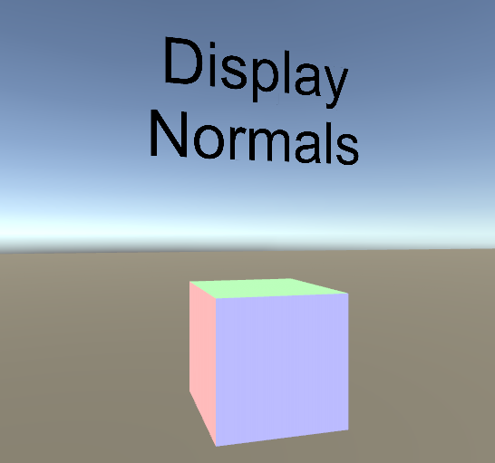
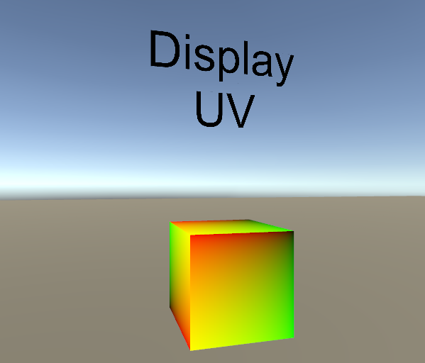
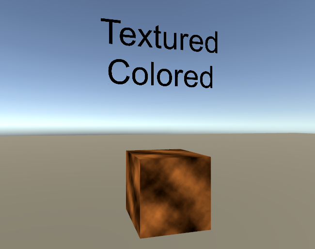
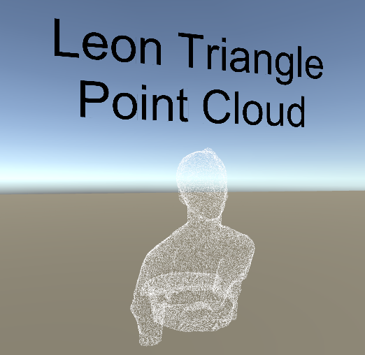

# Shaders
A short exploration of shaders in Unity3D through CU Boulder's Independent Study program.

The Unity project itself is a small VR space where the user can teleport around and view the various shaders discussed below. The contents of this page will consist of a brief demonstration and explanation of each of the shader I have made during this study.
This page will consist of a light tutorial involving Unity shader mechanics as I move through each of the shader programs I have studied. This will hopefully give an idea of the 

Some of the later shaders are derivative of existing projects, which will be cited below.

# Contents

# Shaders 

yo this is the foreword

## Basic Shader

This is what a shader is all about

shader works like this

```c#
Shader "Tutorial/Basic" {
	Properties{
		_Color("Main Color", Color) = (1,0.5,0.5,1)
	}
		SubShader{
			Pass {
				Material {
					//Just uses the default diffuse material, not much of a
					Diffuse[_Color]
				}
				Lighting On
			}
	}
}
```

## Display Normals Shader



```c#
  
Shader "Tutorial/DisplayNormals"
{
	SubShader{

		Pass {

			CGPROGRAM
			//has a vertex function named vert
			#pragma vertex vert
			//has a fragment function named frag
			#pragma fragment frag
			//include for useful functions, appbase is used here
			#include "UnityCG.cginc"

			struct v2f {

				float4 pos : SV_POSITION;
				fixed3 color : COLOR0;

			};

			v2f vert(appdata_base v) {
				v2f o;
				o.pos = UnityObjectToClipPos(v.vertex);
				o.color = v.normal * 0.5 + 0.5;
				return o;
			}

			fixed4 frag(v2f i) : SV_Target{
				return fixed4(i.color,1);
			}

			ENDCG

		}

	}
	Fallback "TexturedColored"
}
```

## Display UV's Shader



```c#
Shader "Tutorial/DisplayUV"
{
	SubShader
	{
		Pass
		{
			CGPROGRAM
			#pragma vertex vert
			#pragma fragment frag

			struct v2f {
				float2 uv : TEXCOORD0;
				float4 pos : SV_POSITION;
			};

			v2f vert(
				float4 vertex : POSITION, // vertex position input
				float2 uv : TEXCOORD0 // first texture coordinate input
				)
			{
				v2f o;
				o.pos = UnityObjectToClipPos(vertex);
				o.uv = uv;
				return o;
			}

			fixed4 frag(v2f i) : SV_Target
			{
				return fixed4(i.uv, 0, 0);
			}
			ENDCG
		}
	}
}
```

## Display UVs Shader



```c#
Shader "Tutorial/Textured Colored" {
	Properties{
		_Color("Main Color", Color) = (1,1,1,0.5)
		_MainTex("Texture", 2D) = "white" { }
	}
		SubShader{
			Pass {

			CGPROGRAM
			#pragma vertex vert
			#pragma fragment frag

			#include "UnityCG.cginc"

			fixed4 _Color;
			sampler2D _MainTex;

			struct v2f {
				float4 pos : SV_POSITION;
				float2 uv : TEXCOORD0;
			};

			float4 _MainTex_ST;

			v2f vert(appdata_base v)
			{
				v2f o;
				o.pos = UnityObjectToClipPos(v.vertex);
				o.uv = TRANSFORM_TEX(v.texcoord, _MainTex);
				return o;
			}

			fixed4 frag(v2f i) : SV_Target
			{
				fixed4 texcol = tex2D(_MainTex, i.uv);
				return texcol * _Color;
			}
			ENDCG

			}
	}
}
```

## PCX's Point Cloud Shader


```c#
Shader "Point Cloud/Disk"
{
    Properties
    {
        _Tint("Tint", Color) = (0.5, 0.5, 0.5, 1)
        _PointSize("Point Size", Float) = 0.05
    }
    SubShader
    {
        Tags { "RenderType"="Opaque" }
        Cull Off
        Pass
        {
            Tags { "LightMode"="ForwardBase" }
            CGPROGRAM
            #pragma vertex Vertex
            #pragma geometry Geometry
            #pragma fragment Fragment
            #pragma multi_compile_fog
            #pragma multi_compile _ UNITY_COLORSPACE_GAMMA
            #pragma multi_compile _ _COMPUTE_BUFFER
            #include "Disk.cginc"
            ENDCG
        }
        Pass
        {
            Tags { "LightMode"="ShadowCaster" }
            CGPROGRAM
            #pragma vertex Vertex
            #pragma geometry Geometry
            #pragma fragment Fragment
            #pragma multi_compile _ _COMPUTE_BUFFER
            #define PCX_SHADOW_CASTER 1
            #include "Disk.cginc"
            ENDCG
        }
    }
    CustomEditor "Pcx.DiskMaterialInspector"
}
```
This is Disk.cginc, the actual file included
```c#

// Pcx - Point cloud importer & renderer for Unity
// https://github.com/keijiro/Pcx

#include "UnityCG.cginc"
//for encoding/decoding colors
#include "Common.cginc"

// Uniforms
half4 _Tint;
half _PointSize;
float4x4 _Transform;

#if _COMPUTE_BUFFER
StructuredBuffer<float4> _PointBuffer;
#endif

// Vertex input attributes
struct Attributes
{
#if _COMPUTE_BUFFER
    uint vertexID : SV_VertexID;
#else
    float4 position : POSITION;
    half3 color : COLOR;
#endif
};

// Fragment varyings
struct Varyings
{
	float2 uv : TEXCOORD0;
    float4 position : SV_POSITION;
#if !PCX_SHADOW_CASTER
    half3 color : COLOR;
    UNITY_FOG_COORDS(0)
#endif
};

// Vertex phase
Varyings Vertex(Attributes input)
{
    // Retrieve vertex attributes.
#if _COMPUTE_BUFFER
    float4 pt = _PointBuffer[input.vertexID];
    float4 pos = mul(_Transform, float4(pt.xyz, 1));
    half3 col = PcxDecodeColor(asuint(pt.w));
#else
    float4 pos = input.position;
    half3 col = input.color;
#endif

#if !PCX_SHADOW_CASTER
    // Color space convertion & applying tint
    #if UNITY_COLORSPACE_GAMMA
        col *= _Tint.rgb * 2;
    #else
        col *= LinearToGammaSpace(_Tint.rgb) * 2;
        col = GammaToLinearSpace(col);
    #endif
#endif

    // Set vertex output.
    Varyings o;
	//set uv coords of varying so we can color point individually
    o.position = UnityObjectToClipPos(pos);
#if !PCX_SHADOW_CASTER
    o.color = col;
    UNITY_TRANSFER_FOG(o, o.position);
#endif
    return o;
}

// Geometry phase
[maxvertexcount(36)]
void Geometry(point Varyings input[1], inout TriangleStream<Varyings> outStream)
{
    float4 origin = input[0].position;
    float2 extent = abs(UNITY_MATRIX_P._11_22 * _PointSize);

    // Copy the basic information.
    Varyings o = input[0];

    // Determine the number of slices based on the radius of the
    // point on the screen.
    float radius = extent.y / origin.w * _ScreenParams.y;
    uint slices = min((radius + 1) / 5, 4) + 2;

    // Slightly enlarge quad points to compensate area reduction.
    // Hopefully this line would be complied without branch.
    if (slices == 2) extent *= 1.2;

    // Top vertex
    o.position.y = origin.y + extent.y;
    o.position.xzw = origin.xzw;
    outStream.Append(o);

    UNITY_LOOP for (uint i = 1; i < slices; i++)
    {
        float sn, cs;
        sincos(UNITY_PI / slices * i, sn, cs);

        // Right side vertex
        o.position.xy = origin.xy + extent * float2(sn, cs);
        outStream.Append(o);

        // Left side vertex
        o.position.x = origin.x - extent.x * sn;
        outStream.Append(o);
    }

    // Bottom vertex
    o.position.x = origin.x;
    o.position.y = origin.y - extent.y;
    outStream.Append(o);

    outStream.RestartStrip();
}

float2 uv : TEXCOORD0;

half4 Fragment(Varyings input) : SV_Target
{
#if PCX_SHADOW_CASTER
    return 0;
#else
	//edit this line of code to get what I want!
	//half4 c = half4(, 0, 0);
	half4 c = half4(input.color, _Tint.a);
    UNITY_APPLY_FOG(input.fogCoord, c);
    return c;
#endif
}

```

## Leon's Point Cloud Shader



```c#
Shader "Unlit/LeonPointCloud"
{
	Properties
	{
		_MainTex ("Texture (RGB)", 2D) = "white" {}
		_Size ("Size", Float) = 0.1
	}
	SubShader
	{
		Tags { "Queue"="AlphaTest" "RenderType"="Transparent" "IgnoreProjector"="True" }
		Blend One OneMinusSrcAlpha
		AlphaToMask On
		Cull Off

		Pass
		{
			CGPROGRAM
			#pragma vertex vert
			#pragma geometry geom
			#pragma fragment frag
			
			#include "UnityCG.cginc"

			sampler2D _MainTex;
			float _Size;

			struct GS_INPUT
			{
				float4 vertex : POSITION;
				float3 normal	: NORMAL;
				float4 color	: COLOR;
				float2 texcoord : TEXCOORD0;
				float2 texcoord1 : TEXCOORD1;
			};

			struct FS_INPUT {
				float4 vertex : SV_POSITION;
				float3 normal : NORMAL;
				float4 color : COLOR;
				float2 texcoord : TEXCOORD0;
			};

			GS_INPUT vert (appdata_full v)
			{
				GS_INPUT o = (GS_INPUT)0;
				o.vertex = v.vertex;
				o.normal = v.normal;
				o.color = v.color;
				return o;
			}


			[maxvertexcount(3)]
			//inputs are in arrays of 1 because it expects a point cloud
			void geom (point GS_INPUT tri[1], inout TriangleStream<FS_INPUT> triStream)
			{
				//initialize to zero, think this is redundant but might avoid errors
				FS_INPUT pIn = (FS_INPUT)0;
				pIn.normal = mul(unity_ObjectToWorld, tri[0].normal);
				pIn.color = tri[0].color;

				float4 vertex = mul(unity_ObjectToWorld, tri[0].vertex);
				float3 tangent = normalize(cross(float3(0,1,0), pIn.normal));
				float3 up = normalize(cross(tangent, pIn.normal));

				pIn.vertex = mul(UNITY_MATRIX_VP, vertex + float4(tangent * -_Size / 1.5, 0));
				pIn.texcoord = float2(-0.5,0);
				triStream.Append(pIn);

				pIn.vertex = mul(UNITY_MATRIX_VP, vertex + float4(up * _Size, 0));
				pIn.texcoord = float2(0.5,1.5);
				triStream.Append(pIn);

				pIn.vertex = mul(UNITY_MATRIX_VP, vertex + float4(tangent * _Size / 1.5, 0));
				pIn.texcoord = float2(1.5,0);
				triStream.Append(pIn);
			}

			float4 frag (FS_INPUT i) : COLOR
			{
				float4 color = i.color;
				//why doesn't this color the mesh?
				color.a = step(0.5, tex2D(_MainTex, i.texcoord).a);
				return color;
			}
			ENDCG
		}
	}
}
```

